## 🧠 Diagram 1: End-to-End MLOps Lifecycle Overview

```mermaid
flowchart LR
    A[📥 Data Collection] --> B[🧹 Data Preprocessing / Feature Engineering]
    B --> C[🧠 Model Training]
    C --> D[🔍 Model Evaluation]
    D --> E[🚀 Model Deployment]
    E --> F[📊 Monitoring & Feedback]
    F --> A

    subgraph "Continuous Improvement"
    A --> B --> C --> D --> E --> F --> A
    end
```

### 🧩 Explanation

* It’s a **continuous loop**, similar to DevOps (CI/CD), but tailored for ML models.
* Each stage can be automated through **pipelines**, managed in platforms like **Kubeflow**, **Vertex AI**, or **MLflow**.

---

## ⚙️ Diagram 2: MLOps Tools & Platforms Comparison

### 🧠 Key Takeaway

> In DevOps, you combine many individual tools.
> In MLOps, a single platform (like **Kubeflow**) integrates all these tools — pipelines, serving, monitoring — on top of Kubernetes.

---

## 🧩 Diagram 3: Kubeflow Architecture (Simplified)

```mermaid
graph TB
    subgraph Kubeflow_Platform[Kubeflow Platform]
    A1[🎓 Notebook Server] --> A2[🧬 Pipeline Components]
    A2 --> A3[📦 Training Jobs - TFJob, PyTorchJob]
    A3 --> A4[🚀 Model Serving - KServe]
    A4 --> A5[📈 Monitoring & Feedback]
    end

    subgraph Underlying_Infrastructure[Underlying Infrastructure]
    B1[(Kubernetes Cluster)]
    B2[(Docker Containers)]
    B3[(Storage: GCS, S3, PVC)]
    end

    A1 & A2 & A3 & A4 & A5 --> B1
    B1 --> B2
    B1 --> B3
```

### ✨ Highlights

* Each step (data prep → training → deploy → monitor) runs as a **containerized component**.
* Kubeflow uses **Kubernetes** as the engine and **Docker** as the packaging format.
* It’s **scalable, reproducible, and automatable**.

---

## 🔄 Diagram 4: Kubeflow Pipeline Flow

```mermaid
flowchart TD
    subgraph Pipeline
    P1[🧩 Component 1: Data Preprocessing]
    P2[🏋️ Component 2: Model Training]
    P3[📊 Component 3: Evaluation]
    P4[🚀 Component 4: Deployment]
    end

    P1 --> P2 --> P3 --> P4

    subgraph Kubeflow_DSL[Kubeflow DSL]
    C1["Python Script (.py)"] --> C2["Compile with DSL Compiler"]
    C2 --> C3["Pipeline YAML (.yaml)"]
    end

    C3 --> Pipeline
```

### 🧠 Explanation

* Developers write **Python-based pipeline scripts** using the **Kubeflow DSL**.
* These are compiled into **YAML manifests**, which Kubeflow uses to orchestrate containers.
* Each component (step) is **independent, reusable, and scalable**.

---

## 🧱 Diagram 5: Real-World Deployment Flow (Example)

```mermaid
sequenceDiagram
    participant Dev as 👩‍💻 Data Scientist
    participant KF as ☁️ Kubeflow Platform
    participant K8s as ⚙️ Kubernetes Cluster
    participant API as 🌍 Deployed Model API
    participant User as 👨‍💼 End User

    Dev->>KF: Push pipeline.py
    KF->>K8s: Deploy training containers
    K8s->>KF: Return trained model artifact
    KF->>K8s: Deploy model with KServe
    User->>API: Send prediction request
    API-->>User: Return prediction result
    KF-->>Dev: Send metrics & drift reports
```

### 🚀 Flow Summary

1. You push a pipeline (`.py` + `.yaml`) into Kubeflow.
2. Kubeflow deploys components to Kubernetes.
3. Model trains, gets deployed, and serves via an API.
4. Feedback loops keep improving the model.

---

Would you like me to now generate a **README.md** version that includes these diagrams, short explanations, and placeholders for your own screenshots (so it looks like a real portfolio project)?
